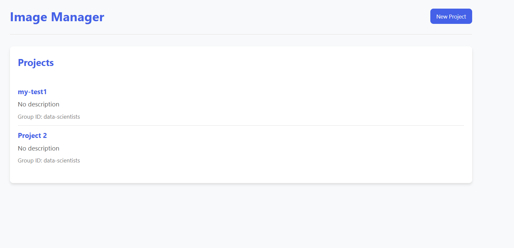
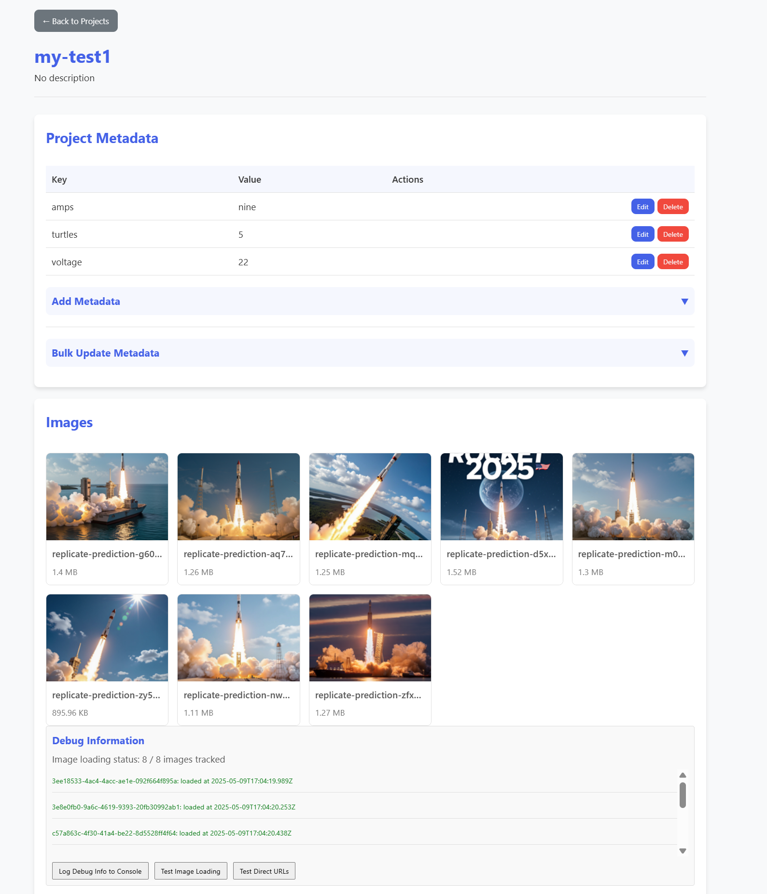
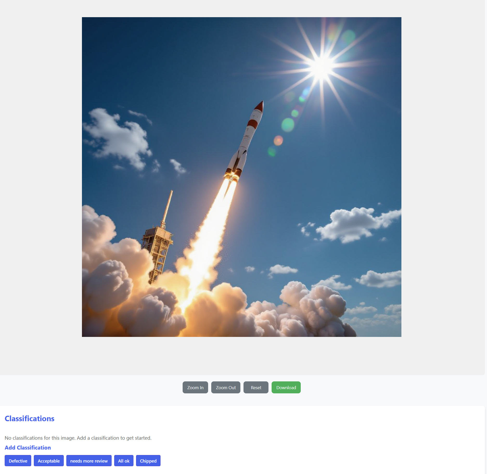

# 🖼️ Image Project Manager

**Powerful image management, classification, and collaboration platform**



## 🚀 What is Image Project Manager?

Image Project Manager is a comprehensive solution for organizing, labeling, and collaborating on image-based projects. Whether you're working on machine learning datasets, managing product photography, or organizing digital assets, our platform provides the tools you need to efficiently manage your visual content.



## ✨ Key Features

- **Project Organization**: Create and manage multiple image projects
- **Image Classification**: Define custom classes and label your images
- **Collaboration**: Add comments and collaborate with team members
- **Metadata Management**: Store and organize key-value metadata for projects and images
- **User Management**: Control access and permissions for your team



## 🔧 Getting Started in Minutes

### Quick Start with Docker

```bash
# Clone the repository
git clone https://github.com/yourusername/image-project-manager.git
cd image-project-manager

# Start with Docker Compose
docker-compose up -d --build

# Access the application at http://localhost:8000
```

### Development Setup

```bash
# Run the start script
./start.sh

# Access the application at http://localhost:8000
```

## 🤝 Join Our Community

We're actively seeking contributors to help make Image Project Manager even better! Whether you're a developer, designer, or user with ideas, your input is valuable.

**Ways to contribute:**
- Report bugs and suggest features
- Improve documentation
- Submit pull requests
- Share your use cases

## 📚 Learn More

For detailed technical information, check out our [Technical Documentation](technical-readme.md).

## 📝 License

This project is licensed under the MIT License - see the LICENSE file for details.
