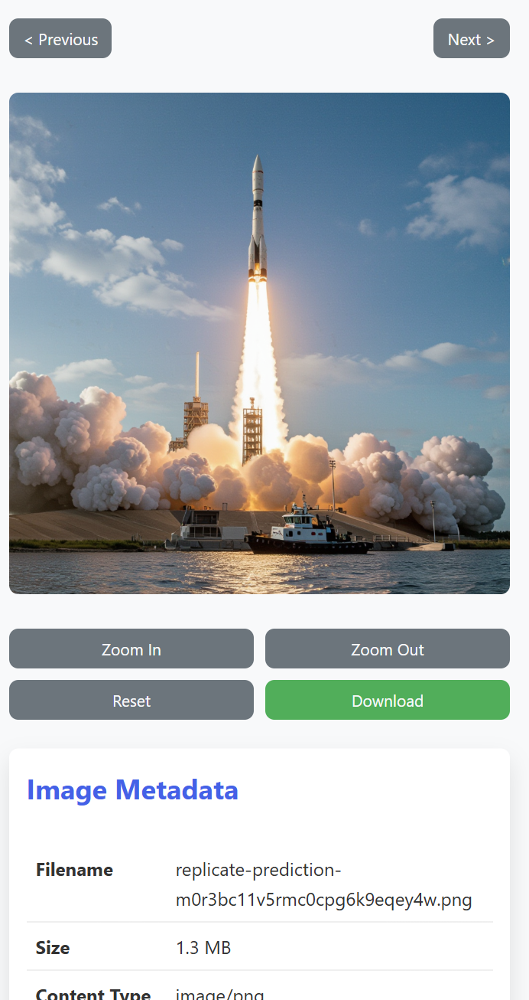

# Data Management API

A containerized FastAPI application for managing projects and associated images/files, using PostgreSQL for metadata and MinIO for object storage. Includes mock authentication and group-based access control for development.

## Features
- Project CRUD (create, list, retrieve)
- Image/file upload, listing, metadata, and presigned download URLs
- PostgreSQL for metadata storage
- MinIO (S3-compatible) for file storage
- Mock authentication and group membership (configurable)
- Docker Compose for local development

## Project Structure



```
.
├── app/
│   ├── __init__.py
│   ├── main.py         # FastAPI app setup and root endpoint
│   ├── config.py       # Pydantic settings management
│   ├── database.py     # Database connection and session
│   ├── models.py       # SQLAlchemy ORM models
│   ├── schemas.py      # Pydantic schemas for API validation
│   ├── crud.py         # Database interaction functions
│   ├── dependencies.py # Auth and authorization dependencies
│   ├── minio_client.py # MinIO connection and functions
│   ├── test_upload.py  # Upload testing utility
│   ├── routers/
│   │   ├── __init__.py
│   │   ├── projects.py # Project related routes
│   │   ├── images.py   # Image related routes
│   │   └── ui.py       # UI related routes
│   └── ui/
│       ├── index.html  # Main UI page
│       ├── project.html # Project details page
│       ├── view.html   # Image/file view page
│       └── static/
│           ├── css/
│           │   └── styles.css # UI styling
│           └── js/
│               ├── index.js   # Main page scripts
│               ├── project.js # Project page scripts
│               └── view.js    # View page scripts
├── 1readme_imgs/      # README images
│   └── image.png      # Project structure image
├── .env              # Environment variables
├── .env.example      # Example environment variables
├── .gitignore        # Git ignore patterns
├── Dockerfile        # Docker build instructions for the app
├── docker-compose.yml # Docker Compose configuration
├── docker-compose.override.yml # Docker Compose override for development
├── k8s.yaml          # Kubernetes deployment manifest
├── README.md         # This documentation
└── requirements.txt  # Python dependencies
```

## Quickstart

1. **Clone the repository**
   ```sh
   git clone <repo-url>
   cd project_management_ui
   ```
2. **Create a `.env` file** (see below for example)
3. **Build and run with Docker Compose**
   ```sh
   docker-compose up --build
   ```
4. **Access the app:**
   - API docs: [http://localhost:8000/docs](http://localhost:8000/docs)
   - MinIO Console: [http://localhost:9090](http://localhost:9090)
   - PostgreSQL: `localhost:5433` (use credentials from `.env`)

## Example `.env`
```
APP_NAME="Data Management API"
SKIP_HEADER_CHECK=True
MOCK_USER_EMAIL="test@example.com"
MOCK_USER_GROUPS='["admin-group", "data-scientists", "project-alpha-group"]'
POSTGRES_USER=admin
POSTGRES_PASSWORD=supersecretpassword
POSTGRES_DB=datamgmt
POSTGRES_SERVER=db
POSTGRES_PORT=5432
DATABASE_URL=postgresql+asyncpg://admin:supersecretpassword@db:5432/datamgmt
MINIO_ENDPOINT=minio:9000
MINIO_ACCESS_KEY=minioadmin
MINIO_SECRET_KEY=minioadminpassword
MINIO_BUCKET_NAME=data-storage
MINIO_USE_SSL=False
```

## Usage
- **API documentation:** [http://localhost:8000/docs](http://localhost:8000/docs)
- **MinIO Console:** [http://localhost:9090](http://localhost:9090) (login with `MINIO_ACCESS_KEY`/`MINIO_SECRET_KEY`)
- **Database:** Connect to PostgreSQL on `localhost:5433` using credentials from `.env`

## Kubernetes Deployment

To run this project on Kubernetes, use the provided `k8s.yaml` manifest. It sets up:
- A dedicated namespace (`data-mgmt`)
- Secrets for environment variables
- Persistent storage for PostgreSQL and MinIO
- Deployments and Services for PostgreSQL, MinIO, and the FastAPI app
- NodePort services for external access to the API and MinIO Console

### Steps to Deploy

1. **Build and push your FastAPI Docker image:**
   Replace `<your-dockerhub-username>` in `k8s.yaml` with your Docker Hub username, then build and push your image:
   ```sh
   docker build -t <your-dockerhub-username>/project-management-ui:latest .
   docker push <your-dockerhub-username>/project-management-ui:latest
   ```
2. **Apply the Kubernetes manifest:**
   ```sh
   kubectl apply -f k8s.yaml
   ```
3. **Access the services:**
   - FastAPI app: `http://<node-ip>:30080`
   - MinIO Console: `http://<node-ip>:30909`

> **Note:**
> - You may need to configure your Kubernetes cluster to support NodePort access.
> - For production, consider using Ingress and secure your secrets appropriately.

## Development Notes
- The app uses mock authentication by default (`SKIP_HEADER_CHECK=True`). Set to `False` to require real authentication (not implemented).
- Project and image access is controlled by group membership (mocked via `.env`).
- All code is in the `app/` directory, with routers for projects and images.

### Dev Container & Docker Compose Override Workflow

For local development with VS Code Dev Containers, this project uses a Docker Compose override and a dedicated dev container setup:

- The main `docker-compose.yml` defines all services (app, db, minio).
- The `docker-compose.override.yml` disables the app service for development, so only db and minio run when you use `docker-compose up -d`.
- The `.devcontainer/docker-compose.yml` defines the dev container, which connects to the same Docker network and mounts your workspace for live code editing.
- The `.devcontainer/devcontainer.json` configures VS Code to use the dev container and install dependencies automatically.

**Development workflow:**
1. Start db and minio with `docker-compose up -d` in the project root.
2. Open the project in VS Code using Dev Containers, which starts the dev container.
3. Run your FastAPI app inside the dev container with:
   ```
   uvicorn app.main:app --host 0.0.0.0 --port 8000 --reload
   ```

This setup avoids duplication, keeps service definitions in sync, and provides a robust development workflow.

## License
Specify your license here.
